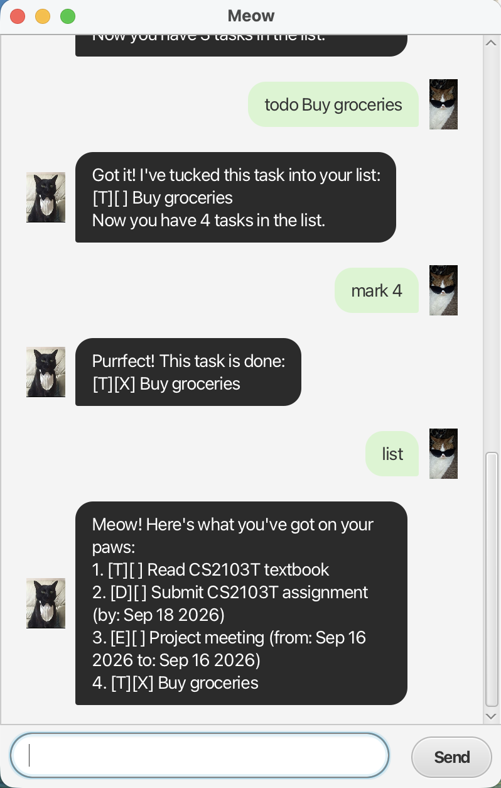

# Meow User Guide

Meow is a task-management chatbot 😼 that helps you keep track of
todos, deadlines, and events through simple text commands.



## Quick Start

1. Download `meow.jar` from the latest GitHub release.
2. Ensure Java 25 is installed.
3. Open a terminal in the folder containing `meow.jar`.
4. Run: `java -jar meow.jar`
5. Start managing your tasks!

## Adding a todo

Adds a task without a date.

Format:
`todo DESCRIPTION`

Example:
`todo read book`

Meow adds the todo to your task list.

## Adding a deadline

Adds a task that needs to be completed by a specific date.

Format:
`deadline DESCRIPTION /by yyyy-MM-dd`

Example:
`deadline submit assignment /by 2026-09-10`

Dates must be entered in the `yyyy-MM-dd` format.

## Adding an event

Adds an event with a start and end date.

Format:
`event DESCRIPTION /from yyyy-MM-dd /to yyyy-MM-dd`

Example:
`event project meeting /from 2026-09-08 /to 2026-09-09`

Both dates must use the `yyyy-MM-dd` format.

The end date cannot be earlier than the start date.

## Listing tasks

Displays all tasks currently stored in Meow.
If the task list is empty, Meow will let you know that there are no tasks yet.

Format:
`list`

Example output:

```
Meow! Here's what you've got on your paws:
1. [T][ ] read book
2. [D][ ] submit assignment (by: Sep 10 2026)
3. [E][ ] project meeting (from: Sep 08 2026 to: Sep 09 2026)
```
## Marking a task as done

Marks a task as completed.

Format:
`mark TASK_NUMBER`

`TASK_NUMBER` refers to the number shown by the list command.


Example:
`mark 2`

## Marking a task as not done

Marks a completed task as not completed.

Format:
`unmark TASK_NUMBER`

`TASK_NUMBER` refers to the number shown by the list command.

Example:
`unmark 2`

## Deleting a task

Removes a task from the task list.

Format:
`delete TASK_NUMBER`

Example:
`delete 3`

## Finding tasks

Finds tasks whose descriptions contain the specified keyword.
If no tasks match the keyword, Meow will let you know that no matching tasks were found.

Format:
`find KEYWORD`

Example:
`find book`

The search is case-insensitive.

## Sorting tasks

Sorts dated tasks chronologically.

Format:
`sort`

Deadlines are sorted according to their due dates, while events are sorted according to their start dates.

Tasks with the same date retain their existing relative order. Todos, which do not have dates, are placed after all dated tasks.

Example:

```
todo buy milk
deadline submit report /by 2026-09-10
event meeting /from 2026-09-05 /to 2026-09-05
deadline quiz /by 2026-09-08
```
After entering:
`sort`

the task order becomes:

```
1. [E][ ] meeting (from: Sep 05 2026 to: Sep 05 2026)
2. [D][ ] quiz (by: Sep 08 2026)
3. [D][ ] submit report (by: Sep 10 2026)
4. [T][ ] buy milk
```
Meow confirms the operation with: 

`All neat and tidy! Your tasks are sorted chronologically.`
   
The sorted order is saved and remains after restarting the application.

## Exiting Meow

Ends the current session.

Format:
`bye`
